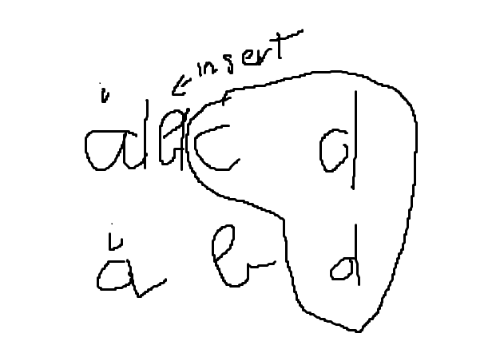
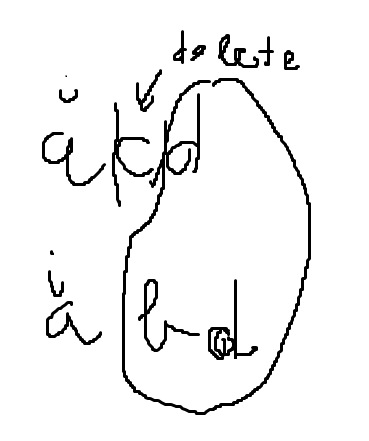
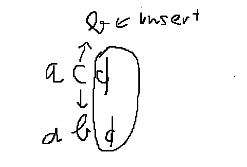
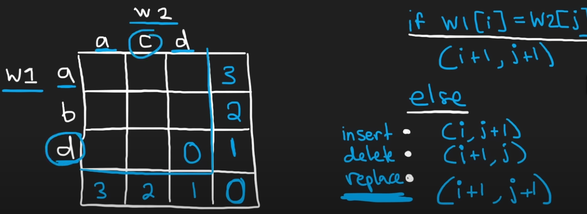

dist(i,j): minimum operations to convert word1[:i] => word2[:j]
## For example, with word1 = acd, word2 = abd
base case: 
- if word1 is empty string "" => convert to word2 need len(word2)
- if word2 is empty string "" => word1 convert to word2 need len(word1)
- if word1 == word2 => convert word1 to word2 need 0

if(word1[i] == word2[j]):
    dist(i, j) = dist(i + 1, j + 1)

if(word1[i] != word2[j]):
there are 3 ways:
    - insert: insert char at [i] in word1, then check minimum distance to convert old remaining(word1[i:]) to word2[j+1:]]
    
    => dist(i, j + 1) + 1
    - delete: delete char at [i] in word1, then check minimum distance to convert remaining(word1[i+1:] to word2[j:])
    
    => dist(i + 1, j) + 1
    - replace: replace char at [i] in word1 by word2[j]
    
    => dist(i + 1, j + 1) + 1
=> minimum distance: dist(i,j) = min(
    dist(i, j + 1) + 1, 
    dist(i + 1, j) + 1,
    dist(i + 1, j + 1) + 1
)

## Dynamic table

