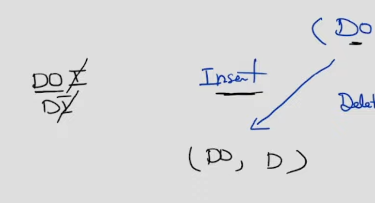

# Problem:
We need to find minimum distance to convert ```word1``` to ``word2``
Each operation we can:
- Insert an element
- Delete an element
- Replace an element

# Approach
Like some problem when compare 2 string, it has pattern of building 2D matrix from that 2 string. <br>

=> We build 2D matrix dist[len(word1) + 1][len(word2) + 1] <br>

dist[i][j]: minimum distances to convert word1[:i + 1] to word2[:j + 1] <br>

## Base cases
When convert from emptystring to a string, it will need length of the string operations.

=> dist[0][j] = j <br>
=> dist[i][0] = i <br>

## Usual cases

We consider the result when convert word1[:i+1] to word2[:j+1] <br>

if ``word1[i]`` == ``word2[j]``: <br>
    dist[i][j] = dist[i - 1][j - 1] <br>

else, the result can be one of three ways:
- Insert an element from ``word2`` into ``word1``: dist[i][j] = dist[i][j - 1] + 1

- Delete an element from ``word1``: dist[i][j] = dist[i - 1][j] + 1

- Replace an element in ``word1`` to ``word2``: dist[i][j] = 1 + dist[i - 1][j - 1]

-> dist[i][j] = min(dist[i - 1][j], dist[i][j - 1], dist[i - 1][j - 1]) + 1

#ref https://youtu.be/Wwy61dHbFgU
